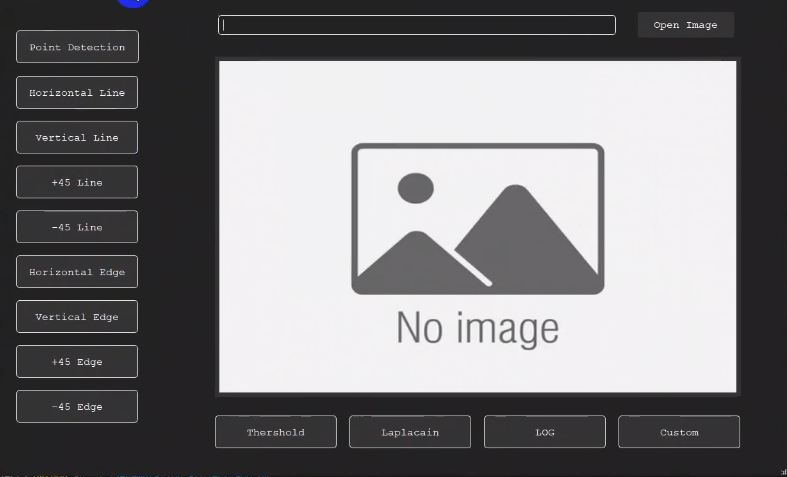

# Image Segmentation Project

**Note: there is a demo video of this project below**

## Application Summary

This application is a graphical user interface (GUI) built with PyQt, leveraging Python and OpenCV to perform a wide range of image segmentation techniques.

## Key Capabilities

- Image Handling

- Load and save images directly from/to the local disk.

- Filtering Options

- Custom Filters

- Define filters of any size dynamically.

### Predefined Filters

- Laplacian Filter: Detects edges in the image.

- Laplacian of Gaussian (LoG): Smooths the image before applying the Laplacian filter.

- Thresholding: Converts images to binary using a specified threshold value.

- Point Detection: Highlights individual points in the image.

- Line Detection: Detects lines in various orientations:

  - Horizontal

  - Vertical

  - +45°

  - -45°

- Edge Detection: Supports Sobel and Prewitt operators for detecting edges in:

  - Horizontal

  - Vertical

  - +45°

  - -45°

## Watch The Demo Video of Project

[Image Segmentation Demo](https://drive.google.com/file/d/1XQMGZ4cWsuNnpowx6vQTRZParoJCn-Gd/view?usp=sharing)
